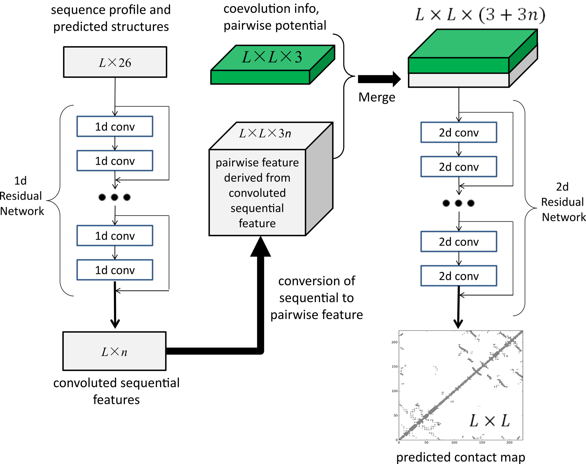

Here are the notes for research papers. I only took notes on what I thought was important for this project.

# Protein secondary structure prediction with a neural network

[LINK](https://www.ncbi.nlm.nih.gov/pmc/articles/PMC286422/)

1989

*Holley LH, Karplus M. Protein secondary structure prediction with a neural network. Proc Natl Acad Sci U S A. 1989;86(1):152-6.*

## Abstract

* The training was intended to teach networks to find relationships between secondary structures and amino acid sequences.
* sample set was 48 proteins
* test set: 14 proteins. 63% accuracy.
* tried to predict 3 structures: helix, sheet, coil.

## Introduction

* Used feedfoward neural networks organized into layers.
* Weights and biases are updated to minimize a loss function

## Methods

* 3 classes: helices (H), sheets (E), and coils
* one input layer, one hidden layer, one output layer
* input layer encodes a moving window of size 17, and is used to predict the central residue
* uses one hot encoding to size of 21 (20 different amino acids plus null input for when the moving window overlaps the terminal end of protein)
* input is essentially a 2-tensor
* output layer: (1,0): helix, (0, 1): sheet, (0,0): coil
* run the numbers through the network, outputs some decimal, then round based on some threshold.
* propogation and gradient descent is used

## Results

* Includes percentage correct under different parameters (like number of hidden layers, window sizes), correlation coefficients, comparison with other algorithms
* proposed physicohemical encoding: encode amino acid sequences based on their physicohemical properties of side chains

# Neural network analysis of protein tertiary structure

[LINK](https://www.sciencedirect.com/science/article/pii/089855299090052A)

1990

*Neural network analysis of protein tertiary structure. George L. Wilcox. Marius Poliac. Tetrahedron Computer Methodology Volume 3, Issues 3–4, 1990, Pages 191-204, IN4, 205-211*

## Abstract 

* describes large scale back-propagation neural network for secondary and tertiary structure prediction
* uses 15 proteins as training

## Introduction

* the predicted output will be a distance matrix

## Methods, Data, and Analysis

* tried several networks, including no layers, 1 layer, 2 layers, layers with direct connections between input and output
* converted the amino acids into "alphabets" corresponding to their hydrophobicity, as it is an important physico-chemical interaction that drives protein folding.
    * ex. tyrosine was assigned -3.4, lycine was assigned 3.3, etc.
    * these numbers were then normalized from -1 to 1
    * the problem is that many of the residues have similar hydrophobicity
* the input was 1* 140 (each protein was less than 140 residues long)
* target was a distance matrix of 140 * 140.
    * calculated from alpha-carbon coordinates of PDB file
    * distances were normalized to 1 by dividing by the maximum distance
    * note that the matrix is symmetrical since d(i,j) = d(j,i). This does create some bias.

## Results

* weights of the neural network was initialized randomly
* some networks did not converge
* though RMS errors were low after training, generalization to new protein structures were very poor
* decreasing the learning rate seemed to have the greatest effect

# Improved prediction of protein secondary structure by use of sequence profiles and neural networks

[LINK](https://www.pnas.org/content/90/16/7558.short)

1993

*Improved prediction of protein secondary structure by use of sequence profiles and neural networks. B Rost, C Sander. Proceedings of the National Academy of Sciences Aug 1993, 90 (16) 7558-7562; DOI: 10.1073/pnas.90.16.7558*

## Abstract 

* combines multiple sequence alignments, balanced training, and structure context training
* accuracy of 70%

## Point of Reference

* baseline of 62% accuracy

## Use of Multiple Sequence Alignments

* the idea is to leverage the fact that proteins with similar sequences also have similar 3 dimensional folds
* multiple sequence alignments rather than a single sequence are the inputs

## Balanced Training

* loops are predicted well, helices are predicted rather well, and strands are predicted poorly
* this is partly due to the inbalance of the training set, which can be solved if we have the training set have the same proportions (1/3 each)

## Training on Structure Context

* though a prediction may have high accuracy, it can be bad at predicting the lengths of sequences 
* can address this problem by feeding the three state prediction output of the first into a second network, which is trained to recognize the structural context of single residue states, without reference to sequence information

## Jury of Networks

* hard voting of 12 different networks

# Combining evolutionary information and neural networks to predict protein secondary structure

[LINK](https://onlinelibrary.wiley.com/doi/abs/10.1002/prot.340190108)

1994

*Rost, Burkhard, and Chris Sander. “Combining Evolutionary Information and Neural Networks to Predict Protein Secondary Structure.” Proteins: Structure, Function, and Genetics, vol. 19, no. 1, 1994, pp. 55–72., doi:10.1002/prot.340190108.*

Read only abstract

## Abstract

* uses position-specific conservation weight as part of the input
* include number of insertions and deletions
* include global amino acid content
* 71.6% accuracy

# PHD: Predicting one-dimensional protein structure by profile-based neural networks

[LINK](https://www.sciencedirect.com/science/article/pii/S0076687996660339)

1996

*Rost, Burkhard. “[31] PHD: Predicting One-Dimensional Protein Structure by Profile-Based Neural Networks.” Methods in Enzymology Computer Methods for Macromolecular Sequence Analysis, 1996, pp. 525–539., doi:10.1016/s0076-6879(96)66033-9.*

Read only abstract

## Abstract

* generate multiple sequence alignment
* feed alignment into neural network system

# Recovery of protein structure from contact maps

[LINK](https://www.sciencedirect.com/science/article/pii/S1359027897000412)

1997

# Mining Protein Contact Maps

[LINK](http://citeseerx.ist.psu.edu/viewdoc/download?doi=10.1.1.19.488&rep=rep1&type=pdf)

2002

# Machine learning methods for protein structure prediction

[LINK](https://www.ncbi.nlm.nih.gov/pubmed/22274898)

2008

*Cheng J, Tegge AN, Baldi P. Machine Learning Methods for Protein Structure Prediction. IEEE Reviews in Biomedical Engineering. 2008;1:41–49. pmid:22274898*

## Abstract

* reviews hidden Markov models, neural networks, support vector machines, Bayesian methods, and clustering methods in 1-D, 2-D, 3-D, and 4-D protein structure predictions

## Introduction

* tertiary structure is described by x,y,z coordinates of atoms
* protein function is determined by structure
* 40,000 out of 2.5 million known sequences available have solved structures (determined experimentally)
* 2d prediction focuses on predicting spatial relationships between residues (like distance, contact map predictions, disulfide bond predictions)
* 2d predictions are independent of rotations and translations of protein
* to predict 3d structure, we can use information from 1d or 2d structures.

* Contact Map:

## Machine Learning Methods for 1-D Structure Prediction

* input: protein primary sequence
* ideas include probabilistic models, ensembles of neural networks, SVMs
* prediction limit of 88%

## Machine Learning Methods for 2-D Structure Prediction

* predict contact maps, which is just a matrix. Each element in this matrix M[i,j] is either 1 or 0, which will depend on whether the Euclidean distance between 2 amino acids at position i,j is above a specified distance threshold. We can measure those distances using the backbone.
* coarser contact map: use only the secondary structure elements
* finer contact map: use every atom
* we use contact maps because they are invariant to translations and rotations
* we can also use contact maps to infer protein folding rates
* some machine learning methods include neural networks, self-organizing maps, SVMs
* use two windows to target 2 amino acids, determine if they are in contact or not (makes this a binary classification). Each position in the window is a vector of 20 numbers (corresponding to 20 profile probabilities)
* can include other 1D info, including predicted secondary structure 
* 2D recursive neural network: to address the problem that amino acids outside the window are not being considered.
* can also try to predict disulfide bonds, very important for structure
* can also predict beta strand pairing
* can use Monte Carlo methods to reconstruct 3D structures from contact maps. Though this is usually unreliable.

## Machine Learning Methods for 3-D Structure Prediction

* WILL COME BACK TO THIS

## Machine Learning Methods for 4-D Structure Prediction

* WILL COME BACK TO THIS

# Automated Procedure for Contact-Map-Based Protein Structure Reconstruction

[LINK](https://www.ncbi.nlm.nih.gov/pmc/articles/PMC3983884/)

2014

# Soft computing methods for the prediction of protein tertiary structures: A survey

[LINK](https://www.sciencedirect.com/science/article/pii/S1568494615003737)

2015

*Soft computing methods for the prediction of protein tertiary structures: A survey. Alfonso E.Márquez-Chamorro. Applied Soft Computing. Volume 35, October 2015, Pages 398-410.* 

## Introduction: background and purpose

* proteins spontaneously folds into a 3D structure after being created in the ribosome
* homology methods: based on comparison with existing and known protein structures.
    * assumes that similar proteins have similar structures
* threading methods (aka sequence-structure alignment or fold recognition methods) try to align a protein sequence to a 3D structure
    * based on the idea that evolution conserves structure rather than sequence
* ab initio methods: find 3D model using just the protein sequence (with laws of chemistry and physics)

## Preliminary Concepts

* homology modeling is usually the first step, then try threading, then finally use ab initio
* in the ab initio method, we first need to extract relevant data from the protein sequence. Examples of data include:
    * frequency of appearance of amino acids
    * physico-chemical properties of the residues
    * evolutionary information (like position specific scoring matrices or correlated mutations)
    * 1D predictions like secondary structure (SS) or solvent accessibility
* predicted output can be contact map or a torsion angle model 

### Input data features

* Evolutionary information:
    * use position-specific scoring matrices (PSSM) and correlated mutations as input encoding
    * correlated mutation: tendency for pairs to mutate together
* Physico-chemical properties:
    * hydrophobicity
    * polarity
    * volume of residues
    * graph shape index 
    * isoelectric point
* Secondary structures
    * predicting the location of α-helices, β-sheets and turns
* Sequence separation distance
    * higher the distance, the lower the probability that the two amino acids are bonded
* Protein length and protein molecular weight
    * length refers to # of amino acids in the sequence

### Output data models

* Torsion angle model
    * Ramachandran plot can help with which angles are not possible
    * determine rotation of protein structure
* Lattice model
    * represent each amino acid as a pair (x, y), where these denote the coordinates of a 2D lattice
    * can also represent as a directional vector (up, down, left, right) to indicate locations of amino acids with respect to one another
* Binary contact map
    * L * L matrix (L is residue length).
    * 0 if contact, 1 if not. The threshold is usually 8A.
    * usually use C-A or C-B for measuring distances between two amino acids
* Distance matrix
    * used instead of binary contact map because forcing 0 or 1 decreases information

### Performance Metrics

* RMSD between the known coordinates and predicted coordinates
* Global distance test-Total score: describes % of well-modeled residues in the model with respect to the target
* TM-score or template modeling score: measures global structural similarity between model and template proteins
* Accuracy: # of correctly predicted contacts
* Converage: proportion of predicted contacts / real contacts

## Neural network methods

* check the paper again, since it mentions alot of other papers and their basic idea

## Support Vector Machines

* same as above

## Evolutionary computation

* same as above

## Statistical approaches

* same as above

# Protein Secondary Structure Prediction Using Cascaded Convolutional and Recurrent Neural Networks

[LINK](https://arxiv.org/pdf/1604.07176.pdf#page=8&zoom=100,0,445)

2016

# Protein Secondary Structure Prediction Using Deep Convolutional Neural Fields

[LINK](https://www.nature.com/articles/srep18962)

2016

# A Unified Deep Learning Model for Protein Structure Prediction

[LINK](https://ieeexplore.ieee.org/document/7985752)

2017

*L. Bai and L. Yang, "A Unified Deep Learning Model for Protein Structure Prediction," 2017 3rd IEEE International Conference on Cybernetics (CYBCONF), Exeter, 2017, pp. 1-6. doi: 10.1109/CYBConf.2017.7985752*

## Abstract

* use deep CNN to learn high level relational features

# Protein contact maps: A binary depiction of protein 3D structures

[LINK](https://www.sciencedirect.com/science/article/pii/S0378437116305507)

2017

# Accurate De Novo Prediction of Protein Contact Map by Ultra-Deep Learning Model

[LINK](https://journals.plos.org/ploscompbiol/article?id=10.1371/journal.pcbi.1005324)

2017

*Wang S, Sun S, Li Z, Zhang R, Xu J (2017) Accurate De Novo Prediction of Protein Contact Map by Ultra-Deep Learning Model. PLoS Comput Biol 13(1): e1005324. https://doi.org/10.1371/journal.pcbi.1005324*

## Abstract

* uses evolutionary coupling(ec) and sequence conservation information with deep residual nn

## Introduction

* de novo protein structure prediction
* direct evolutionary coupling analysis (DCA)
* evolutionary coupling analysis (ECA): predicts contacts by identifying co-evolved residues in a protein
    * but needs a lot of matches to be effective
* predicting contact map: sort of like pixel level labeling 
    * though some problems include:
        * not a ton of research in ML community on pixel level labeling 
        * contact maps cannot be resized like in actual images
        * number of positive and negative labels are unbalanced
* model was trained on solved protein structures, and tested on CASP and CAMEO

## Results

* basic idea:
    1. feed sequence into a 1D residual network
        * output is L * n, where n is the number of new features (or hidden neurons) that was created by the last CNN of the network
    2. convert that to a 2D matrix through outer concatenation
    3. Feed that into the 2nd module with pairwise features (co-evolution information, pairwise contact and distance potential)
    4. Output of 2D CNN is fed into a logistic regression that predicts prob that any two residues form contact

* predicted accuracy with respect to the number of sequence homologs
* fed the top predicted contacts into CNS suite to create 3D models of proteins
* measured quality of the 3D model with TMscore (score of 0 to 1).
    * TMscore of >.5 is likely to have correct structure
* also measured using lDDT (score of 0 to 100)
* the authors also compared their contact-assisted models with other template-based models. Their results imply:
    * contact based is much better when the protein does not closely resemble an existing protein
    * contact assisted is useful for membrane proteins
    * the fact that contact-assisted models outperformed template-based models implies that the nn did not just copy the training contacts
* mentions a bunch of case studies for some individual proteins

## Method

* ReLU activation in residual networks
* window size of 17 in 1D, 3 * 3 or 5 * 5 in 2D
* for 1D residual network, the depth was fixed to 6
* for 2D residual network, about 60 neurons for each layer (60 layers)
* when predicting the contact map, the image was predicted all at once, and not pixel by pixel
* to convert from sequential to pairwise features, for a pair i,j of residues, they concatenated v(i), v(i+j/2), v(j) to a single vector. This acts as an input feature. The input feature also includes mutual information, EC information calculated by CCMpred, and pairwise contact potential
* for loss function, use maximum likelihood to train the model parameters
    * since there are more noncontacts than contacts in the contact map, they assigned a larger weight to residue pairs forming a contact 
* l2 norm regularization
* algorithm was implemented on Theano, and ran on a GPU
* used minibatch 
    * sorted all proteins by lengths and grouped them in the minibatches
* 0 padding to shorter proteins
* paper also includes a bunch of programs used to compare and evaluate results, generate template based modeling, and construct 3D structure with contact assisting folding

## Training and Test Data

* Test set: 150 Pfam families, 105 CASP11 test proteins, 76 hard CAMEO test proteins, and 398 membrane proteins
    * all <400 residues, <40% sequence identity
* Train set: subset of PDB25, <25% sequence identity
    * protein was excluded if:
        * <26 residues or >700 residues
        * resolution worse than 2.5A
        * has domains made up of multiple protein chains
        * no DSSP information
        * inconsistencies between PDB, DSSP and ASTRAL info
        * has >25% sequence identity or BLAST E-value <0.1 with a test protein
    * 6767 proteins

## Protein Features
* input features also include protein sequence profile, predicted 3-state secondary structure and 3-state solvent accessibility, direct co-evolutionary information generated by CCMpred, mutual information, and pairwise potential
* other programs were used to find these features
* these were inserted in the beginning, resulting in L * 26

# Prediction of 8-state protein secondary structures by a novel deep learning architecture

[LINK](https://bmcbioinformatics.biomedcentral.com/articles/10.1186/s12859-018-2280-5)

2018

# End-to-end differentiable learning of protein structure

[LINK](https://www.biorxiv.org/content/10.1101/265231v2)

2018

*End-to-end differentiable learning of protein structure. Mohammed AlQuraishi. bioRxiv 265231; doi: https://doi.org/10.1101/265231*

## Abstract

* uses RNN
* parameterized local protein structures with torsional angle
* coupled local protein structure to its global representation with recurrent geometric units
* used differential loss function

## Introduction

* introduces building blocks for constructing end-to-end differentiable model of protein structure
* want to try to predict protein structure without co-evolutionary information

## Results

### Recurrent Geometric Networks

* input: sequence of amino acids and PSSMs of a protein
* output: 3D structure
* model consists of three stages: computation, geometry, and assessment. Call the model Recurrent Geometric Networks (RGN)
    * pass through a sequence, output is converted into angles, which are then converted to coordinates
* assumes fixed bond length and angle
* will come back to this paper

# Deep Neural Network for Protein Contact Prediction by Weighting Sequences in a Multiple Sequence Alignment

[LINK](https://www.biorxiv.org/content/10.1101/331926v1.abstract)

2018

*Deep Neural Network for Protein Contact Prediction by Weighting Sequences in a Multiple Sequence Alignment. Hiroyuki Fukuda, Kentaro Tomii. bioRxiv 331926; doi: https://doi.org/10.1101/331926*

## Abstract

* presents a new approach to contact map prediction by extracting correlation information from MSA using deep learning
* can weigh each sequence from MSA to reduce noise from sequences

## Introduction

* evolutionary information has noisy signals

## Materials and Methods

* used amino acids from PISCES pdb server that meet these conditions:
    * sequence identity cutoff: 20%
    * resolution cutoff: 2.5 Å
    * R-factor cutoff, 1.0
    * generated day: July 20, 2017
    * number of chains: 12094
* contact distance cutoff was 8A for C-B atoms.
    * for glycine, C-A atoms were used instead of C-B
* PDB files has missing values in them
    * marked it as NaN, and excluded it when calculating loss
* removed any with >25% sequence identity or having BLAST E-value <0.1 with test set
* they eliminated proteins with >700 residues or  <25 residues
* take covariance matrices calculated from MSAs as inputs. Feed that into nn to obtain probability of the contact

# A Novel Approach to Protein Folding Prediction based on Long Short-Term Memory Networks: A Preliminary Investigation and Analysis

[LINK](https://ieeexplore.ieee.org/abstract/document/8489514)

2018

*L. T. Hattori, C. M. V. Benitez, M. Gutoski, N. M. R. Aquino and H. S. Lopes, "A Novel Approach to Protein Folding Prediction based on Long Short-Term Memory Networks: A Preliminary Investigation and Analysis," 2018 International Joint Conference on Neural Networks (IJCNN), Rio de Janeiro, 2018, pp. 1-8. doi: 10.1109/IJCNN.2018.8489514*

## Abstract 

* paper explains how they use LSTMs to approach the protein folding problem
* WILL GET BACK TO THIS

# Accurate prediction of protein contact maps by coupling residual two-dimensional bidirectional long short-term memory with convolutional neural networks

[LINK](https://academic.oup.com/bioinformatics/article/34/23/4039/5040307)

2018

*Jack Hanson, Kuldip Paliwal, Thomas Litfin, Yuedong Yang, Yaoqi Zhou; Accurate prediction of protein contact maps by coupling residual two-dimensional bidirectional long short-term memory with convolutional neural networks, Bioinformatics, Volume 34, Issue 23, 1 December 2018, Pages 4039–4045, https://doi.org/10.1093/bioinformatics/bty481*

## Abstract 

* RNNs are used since it is great for propagating information throughout the amino acid sequence
* stacked residual CNNs with bidirectional LSTMs

# Protein tertiary structure modeling driven by deep learning and contact distance prediction in CASP13

[LINK](https://www.biorxiv.org/content/10.1101/552422v1.abstract)

2019

*Protein tertiary structure modeling driven by deep learning and contact distance prediction in CASP13. Jie Hou, Tianqi Wu, Renzhi Cao, Jianlin Cheng. bioRxiv 552422; doi: https://doi.org/10.1101/552422*

## Introduction

* co-evolutionary analysis: based on that two amino acids that are in contact must co-evolve to maintain that contact relationship
    * if an amino acid were to mutate and change charge, the other amino acid in contact must also change charge for the two to stay in contact
    * used as inputs
* integrated 1D, 2D, and 3D structural features for predictions

##  Materials and Method

* take in a protein, run it through protein sequence databases to generate multiple sequence alignments (MSA) to build Position Specific Scoring Matrices (PSSM) and Hidden Markov models (HMM)
* the intial sequence was also used to predict secondary structure, solvent accessibility, and disorder regions 

* Decided to stop reading this because I realized it doesn't really talk about how the model is built, but how it was used and its results. However, will definitely look back at this to see what extra elements I can include.